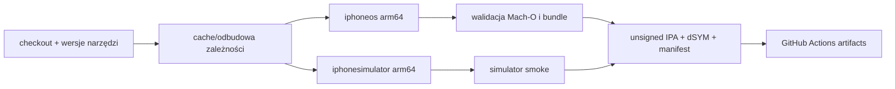

# GitHub Actions dla portu iOS

## Kontrakt

- Minimalny system: **iOS/iPadOS 16.4**.
- CI/CD: wyłącznie GitHub Actions w `tryk016/openmw`.
- Targety: `iphoneos/arm64` i `iphonesimulator/arm64`.
- Dystrybucja: GitHub Actions artifacts oraz GitHub Releases.
- Instalacja: SideStore albo lokalny Xcode.
- CI nie przechowuje i nie używa prywatnych danych podpisujących użytkownika.
- IPA i repozytorium nie zawierają danych Morrowinda.
- Kompatybilność innych platform nie jest sprawdzana ani gwarantowana.

`CMAKE_OSX_DEPLOYMENT_TARGET`, `IPHONEOS_DEPLOYMENT_TARGET` generowanego projektu
i wartość w metadanych bundle muszą być zgodne i wynosić `16.4`.

## Planowane workflow

### `.github/workflows/ios-ci.yml`

Uruchomienia:

- pull request do `ios/main`;
- push do `ios/main`;
- ręczne `workflow_dispatch`.

Graf zadań:



Obowiązkowe kontrole:

- zgodność tabeli postępu `ROADMAP.md` z checkboxami faz 0–12, sumą, procentem
  i statusem każdej fazy;
- wypisanie wersji obrazu runnera, Xcode, SDK, CMake i Clang;
- configure/build z deployment targetem `16.4`;
- brak nierozwiązanych `try_run`;
- poprawna platforma i architektura każdej biblioteki;
- brak niezamierzonych dynamicznych zależności;
- obecność zasobów i statycznie rejestrowanych pluginów;
- build bez code signing i bez sekretów;
- smoke test symulatora;
- test, że bundle nie zawiera plików gry;
- utworzenie manifestu z commit SHA i bazowym upstream SHA.

### `.github/workflows/ios-release.yml`

Uruchomienia:

- tag `ios-v*`;
- ręczne `workflow_dispatch` dla release candidate.

Workflow ponownie buduje kod z tagu, zamiast promować przypadkowy artefakt z
innego commita. Po przejściu G5 publikuje GitHub Release zawierający:

- `OpenMW-iOS-unsigned.ipa`;
- build symulatora jako osobny artefakt deweloperski;
- `OpenMW-iOS.dSYM.zip`;
- `SHA256SUMS`;
- manifest wersji i zależności;
- SBOM;
- notices/licencje;
- odnośnik do corresponding source dokładnego tagu;
- instrukcję SideStore/Xcode;
- wyraźną informację „game data not included”.

Kontrakt roadmapy można uruchomić lokalnie bez instalowania zależności:

```bash
node CI/ios/test-roadmap-contract.js --self-test
```

Polecenie najpierw wykonuje self-testy parsera na kopiach roadmapy zmienionych
w pamięci, a następnie sprawdza kanoniczny `docs/ios-port/ROADMAP.md`.

## Runner i Xcode

Pierwszym runnerem jest jawny label `macos-15`, nie ruchomy `macos-latest`.
Aktualnie standardowy publiczny runner `macos-15` jest Apple Silicon i ma
ograniczone RAM oraz storage, dlatego:

- buildy zależności są cache'owane po hashach lockfile/toolchainu;
- duże slice'y budujemy sekwencyjnie, jeśli równoległość przekracza pamięć;
- po każdym etapie usuwamy niepotrzebne katalogi pośrednie;
- artifacty nie zawierają całego katalogu build;
- okres retencji artifactów PR jest krótki, a trwałe wydania trafiają do
  GitHub Releases.

Workflow wybiera konkretną stabilną instalację Xcode dostępną na obrazie i
sprawdza jej numer przed buildem. Wersję Xcode aktualizujemy niezależnie od
minimalnego deployment targetu `16.4`. Nie wymagamy od runnera symulatora iOS
16.4: CI używa zainstalowanego, wspieranego runtime symulatora i asertywnie
sprawdza `minos 16.4`. G0 wymaga fizycznego PASS na iOS 16.4+, natomiast
dokładny runtime 16.4 jest dolną bramką kompatybilności przed G5, gdy nie jest
dostępny podczas G0.

## Cache zależności

Klucz cache zawiera co najmniej:

```text
ios-deps-v1-${runner.arch}-${xcode-version}-${dependency-lock-hash}-${preset}
```

Nie używamy cache z niezaufanego PR do wykonania skryptów. Każda paczka
zależności ma manifest:

- platforma i architektura;
- wersja/commit źródła;
- hash źródła;
- opcje CMake;
- compiler i SDK;
- deployment target;
- licencja.

Workflow `iOS dependencies` buduje obecnie kumulatywny profil
`multimedia-foundation` osobno dla device i simulatora. Profil zawiera pełny
`ui-foundation` i dodaje statyczny OpenAL Soft 1.24.3 oraz minimalny statyczny
FFmpeg 7.1.1. Każdy slice wykonuje
czysty build online, walidację targetowego prefiksu, osobną walidację
`icu[tools]` hosta, link probe, czysty rebuild offline oraz ponowną walidację i
link. Simulator wykonuje probe MyGUI, OpenAL i dokładnej allowlisty FFmpeg
oraz loguje `multimedia foundation PASS`. Artefakt zawiera znormalizowaną
closure vcpkg, hostowe metadane ICU, statyczne archiwa, wynikową konfigurację
FFmpeg, odpowiadające źródło/patch, SPDX, notices i dedykowane binaria probe;
timeout joba wynosi 180 minut.

## Artefakt SideStore

CI buduje aplikację z wyłączonym podpisywaniem:

```text
CODE_SIGNING_ALLOWED=NO
CODE_SIGNING_REQUIRED=NO
```

Gotowy `OpenMW.app` jest pakowany w standardowy układ:

```text
Payload/OpenMW.app
```

i kompresowany jako `OpenMW-iOS-unsigned.ipa`. SideStore podpisuje IPA
certyfikatem użytkownika. Nie zakładamy stałego Team ID ani provisioning
profile w buildzie z GitHuba.

Test akceptacyjny obejmuje:

- instalację IPA przez SideStore;
- pierwszy start i import własnych danych;
- ponowne podpisanie/refresh;
- aktualizację do następnego IPA;
- zachowanie save'ów, konfiguracji i zaimportowanych danych;
- czytelny błąd, jeżeli zmieniony bundle ID tworzy nowy kontener.

Przy darmowym Personal Team profile aplikacji mają ograniczony czas ważności,
więc instrukcja musi opisać okresowe odświeżanie. SideStore wykonuje
re-sign/refresh przy użyciu konta użytkownika.

## Instalacja z Xcode

Xcode jest osobnym, lokalnym kanałem:

1. użytkownik pobiera źródła dokładnego tagu;
2. wybiera własny Team w Signing & Capabilities;
3. Xcode zarządza development provisioning;
4. użytkownik wybiera urządzenie i uruchamia target;
5. dla Personal Team okres ważności profilu wymaga okresowego ponownego
   zbudowania/instalacji.

Artefakt CI nie zawiera konta Apple. Jeśli później dodamy możliwość lokalnego
podpisania pobranego `.app`, będzie to skrypt uruchamiany na komputerze
użytkownika, nigdy job publicznego CI.

## Sekrety i bezpieczeństwo

Zabronione w repo, logach, cache i artifacts:

- Apple ID i hasła aplikacyjne;
- prywatne klucze i certyfikaty `.p12`;
- provisioning profiles;
- SideStore pairing files i UDID;
- dane Morrowinda, save'y i prywatne ścieżki testera.

Workflow release korzysta wyłącznie z krótkotrwałego `GITHUB_TOKEN` z
minimalnym zakresem `contents: write`. Workflow PR ma `contents: read`.
Zewnętrzne actions należy przypinać zgodnie z polityką repo i aktualizować
kontrolowanymi PR-ami.

## Co CI może, a czego nie może potwierdzić

GitHub Actions potwierdza:

- powtarzalny cross-build;
- linkowanie i strukturę bundle;
- testy core możliwe do uruchomienia w środowisku Apple;
- uruchomienie w symulatorze;
- kompletność artefaktu i dokumentów release.

GitHub-hosted runner nie potwierdza:

- działania GL4ES/GPU na fizycznym urządzeniu;
- termiki, jetsam i realnego limitu pamięci;
- kontrolera, touch i audio route na konkretnym sprzęcie;
- instalacji/refreshu SideStore;
- zachowania na dokładnym minimalnym iOS 16.4.

Te wyniki pozostają obowiązkowymi, udokumentowanymi testami urządzeń w
odpowiednich bramkach. G0 potwierdza instalację i lifecycle na urządzeniu
16.4+, a dokładna dolna wersja systemu musi przejść przed G5.

## Źródła

- [GitHub-hosted runners reference](https://docs.github.com/en/actions/reference/runners/github-hosted-runners)
- [GitHub runner image macOS 15](https://github.com/actions/runner-images/blob/main/images/macos/macos-15-Readme.md)
- [GitHub: przechowywanie artifacts](https://docs.github.com/en/actions/tutorials/store-and-share-data)
- [Apple: uruchamianie na symulatorze i urządzeniu](https://developer.apple.com/documentation/Xcode/running-your-app-on-simulated-or-physical-devices)
- [Apple: Personal Team i ograniczenia profili](https://developer.apple.com/help/account/basics/about-your-developer-account/)
- [SideStore: dokumentacja](https://docs.sidestore.io/)
- [SideStore: FAQ o podpisywaniu i refresh](https://docs.sidestore.io/docs/faq)
