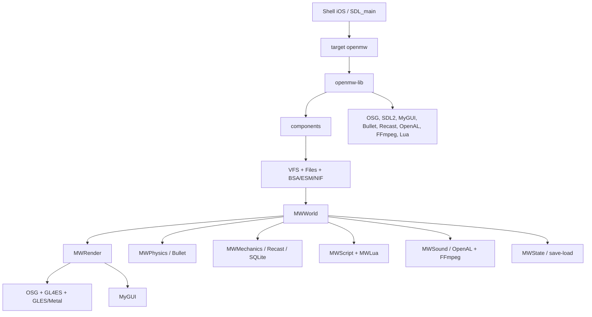

# Mapa projektu OpenMW pod port iOS

Mapa opisuje upstream `82c6847402323e140794cf1f940b68cf3165eaea`.
Jej celem nie jest zastąpienie dokumentacji OpenMW, lecz pokazanie granic prac
portowych i zależności, które trzeba testować.

Mapa jest czytana zgodnie z [ADR-0002](ADR-0002-IOS-ONLY-SCOPE.md): jedynym
wspieranym produktem jest iOS/iPadOS 16.4+. Elementy innych platform opisujemy
tylko jako kod źródłowy do wykorzystania albo usunięcia, nie jako wymaganie
kompatybilności.

## Przepływ uruchomienia

`apps/openmw/engine.cpp` jest composition rootem. Tworzy okno i viewer, VFS,
resource system, input, UI, dźwięk, świat, fizykę, mechanikę, skrypty, dialog i
state manager, a następnie ustala kolejność aktualizacji w głównej pętli.
Większość prac platformowych skupia się przed `Engine::go()` i na granicach
render/input/files/audio, nie w regułach gry.

## 1. Build i pakiet — katalog główny, `cmake/`, `CI/`

### Główne elementy

- `CMakeLists.txt`
  - wymaga C++20;
  - definiuje wszystkie aplikacje i opcje;
  - wyszukuje/pobiera zależności;
  - traktuje `APPLE` jako macOS;
  - wykonuje desktopowe pakietowanie CPack.
- `cmake/`
  - find modules i testy możliwości bibliotek;
  - `CheckLuaCustomAllocator.cmake` używa `try_run` natywnie, ale podczas
    cross-compile przechodzi przez istniejący compile-only `try_compile`;
  - `OpenMWMacros.cmake` definiuje targety i whole-archive.
- `CI/`, `.github/workflows/`, `.gitlab-ci.yml`
  - Linux, Windows, macOS i historyczne ścieżki Android;
  - brak targetu iOS;
  - w forku zastępujemy macierz produktu workflow GitHub Actions dla iOS.

### Prace iOS

- dodać jednoznaczne `OPENMW_IOS`/`CMAKE_SYSTEM_NAME STREQUAL iOS`;
- zastąpić macOS-owe `if(APPLE)` bez obowiązku zachowania ścieżki macOS;
- utworzyć presety `ios-device` i `ios-simulator`;
- ustawić deployment target `16.4` we wszystkich konfiguracjach;
- wymusić statyczny runtime;
- zbudować tylko `openmw`, `openmw-lib` i `components`;
- dodać GitHub Actions na runnerze macOS do device/simulator cross-build;
- wyłączyć desktopowe install/CPack.

## 2. Aplikacje — `apps/`

### `apps/openmw/` — portowany runtime

- `main.cpp`
  - inicjalizuje platformę, konfigurację, logi i zasoby;
  - parsuje argumenty Boost.Program_options;
  - uruchamia `Engine::go()`;
  - iOS potrzebuje syntetycznej konfiguracji/argumentów i SDL entry point.
- `androidmain.cpp`
  - wzorzec mobilnego adaptera;
  - ustawia GL4ES i mapowanie wirtualnego kontrolera;
  - nie należy kopiować JNI, tylko wykorzystać wzorzec separacji.
- `engine.cpp/.hpp`
  - inicjalizacja SDL i okna;
  - utworzenie `GraphicsWindowSDL2`;
  - składanie subsystemów;
  - główna pętla, ładowanie, render i shutdown.
- `CMakeLists.txt`
  - buduje dużą bibliotekę statyczną `openmw-lib`;
  - target Android jest biblioteką shared;
  - blok Apple pakuje macOS bundle i linkuje Cocoa/IOKit;
  - potrzebny osobny target iOS app bundle.

### Aplikacje nieportowane w MVP

- `apps/launcher/`
  - desktopowy Qt launcher;
  - zastąpiony małym shellem importu/ustawień iOS.
- `apps/wizard/`
  - instalator/unshield;
  - dane dostarcza użytkownik przez Files.
- `apps/opencs/`
  - OpenMW Construction Set, Qt;
  - pozostaje narzędziem desktopowym.
- `apps/bsatool`, `esmtool`, `essimporter`, `mwiniimporter`, `niftest`,
  `navmeshtool`, `bulletobjecttool`
  - narzędzia host-only;
  - mogą przygotowywać dane/test fixtures, ale nie wchodzą do IPA.

### Testy aplikacyjne

- `apps/components_tests/`
- `apps/openmw_tests/`
- `apps/opencs_tests/`
- `apps/benchmarks/`

Hostowe testy mają pozostać zielone. iOS potrzebuje małego zestawu smoke i
integration zamiast portowania całego gtest runnera w pierwszej fazie.

## 3. Interfejsy usług — `apps/openmw/mwbase/`

- `environment.*`
  - globalny service locator;
  - kolejność życia usług ma znaczenie przy background/shutdown.
- `world.*`
  - świat, scena, czas, pogoda, physics i rendering.
- `inputmanager.*`
  - abstrakcja akcji gry.
- `windowmanager.*`
  - UI MyGUI, tryby GUI i wiadomości.
- `soundmanager.*`
  - audio 2D/3D i muzyka.
- `scriptmanager.*`, `luamanager.*`
  - legacy MWScript i Lua.
- `mechanicsmanager.*`, `dialoguemanager.*`, `journal.*`
  - logika gry.
- `statemanager.*`
  - new game, save/load i quit.

Port powinien dodawać adaptery przy tych interfejsach tylko tam, gdzie jest to
konieczne. Przebudowa service locatora nie należy do MVP.

## 4. Świat i gameplay — `apps/openmw/`

### `mwworld/`

- ładowanie content files;
- store rekordów i live refs;
- komórki, streaming i preload;
- przedmioty, kontenery, inventory;
- pogoda, czas i projektile;
- scene/world model.

Ryzyka iOS:

- duży RAM podczas zmiany komórek;
- liczba zadań preload;
- storage i case sensitivity danych/modów;
- stabilność przy background w trakcie ładowania.

### `mwclass/`

- zachowania typów obiektów:
  - NPC/creature;
  - weapon/armor/clothing;
  - door/container/activator;
  - ingredient/potion/book;
  - leveled lists i rekordy ESM4.

Kod jest zasadniczo platform-independent i powinien wymagać głównie testów.

### `mwmechanics/`

- AI i aktorzy;
- walka, magia, statystyki;
- pathfinding i steering;
- dialogowe/mechaniczne akcje;
- alchemy, enchanting, repair i training.

Ryzyka iOS:

- CPU/termika;
- częstotliwość aktualizacji;
- liczba aktorów;
- wątki navmesh.

### `mwphysics/`

- Bullet collision i ruch;
- raycast/contact tests;
- actors/projectiles;
- wielowątkowa fizyka.

Ryzyka iOS:

- OpenMW wymaga Bullet double precision;
- wydajność arm64;
- budżet workerów i pamięci.

### `mwstate/`

- lista postaci;
- save/load;
- quicksave.

Jest krytyczny dla lifecycle. Background nie może polegać wyłącznie na
destruktorze procesu.

### `mwdialogue/`, `mwscript/`, `mwlua/`

- dialog, questy i journal;
- kompilator/interpreter klasycznych skryptów;
- runtime Lua, eventy, bindings, storage i Lua UI.

Na iOS:

- zachować MWScript;
- zacząć od PUC Lua, bez JIT;
- wspierać mody i skrypty importowane z legalnie posiadanymi danymi bez
  osobnego profilu App Store;
- testować zapis trwałego storage Lua.

## 5. Rendering — `apps/openmw/mwrender/`

### Scena

- `renderingmanager`, `objects`, `actors`;
- kamera, culling i render bins;
- animacje, rigging i weapon animation;
- teren, groundcover i object paging;
- sky, weather, precipitation;
- water, ripples i reflections;
- local/global map;
- cienie, postprocessing, luminance i distortion;
- screenshot manager.

### Profil MVP

- podstawowe obiekty i animacje;
- teren, niebo, prosta woda;
- podstawowe światła i fog;
- GUI;
- bez stereo/multiview;
- bez compute ripples;
- bez kosztownego postprocessingu;
- cienie jako funkcja późniejsza;
- ograniczony render scale.

### Krytyczne granice

- `components/sdlutil/sdlgraphicswindow.*`
  - tworzy GL context dla OSG;
  - ma istniejący hook GL4ES;
  - wymaga deterministycznego profilu iOS: baseline GLES 2 oraz osobny test
    GLES 3.0, nigdy żądanie GLES 3.2.
- `components/myguiplatform/`
  - fixed function OpenGL;
  - musi przejść przez GL4ES albo dostać renderer shaderowy.
- `components/sceneutil/`
  - rozszerzenia, RTT, light manager, work queues.
- `components/resource/`
  - cache obrazów/scen/animacji.
- `components/terrain/`, `shader/`, `fx/`, `std140/`, `stereo/`
  - feature flags i profil ograniczeń iOS.
- `files/shaders/`
  - ścieżki `compatibility` GLSL 120 i `core` GLSL 430;
  - translacja/patchowanie jest częścią bramki renderingu.

## 6. UI — `apps/openmw/mwgui/`, `components/lua_ui/`

### Istniejące możliwości

- wszystkie ekrany gry MyGUI;
- controller navigation;
- overlays przycisków kontrolera;
- text input;
- Lua UI;
- skalowanie widgetów i HUD.

### Luki iOS

- safe area i orientacja;
- rozmiary w punktach vs pikselach Retina;
- brak hover w touch-only;
- touch drag/drop i gesty;
- klawiatura ekranowa;
- czytelność telefonu;
- dostępność i haptyka.

MVP powinien najpierw osiągnąć pełny gameplay kontrolerem. Overlay dotykowy
dochodzi po ustabilizowaniu mapowania akcji.

## 7. Input — `apps/openmw/mwinput/`, `components/sdlutil/`

### `mwinput/`

- `actions` i bindingi;
- mysz i klawiatura;
- game controller;
- sensory i żyroskop;
- przełączanie trybu UI/gameplay.

### `sdlutil/`

- input event pump;
- graphics window;
- controller mappings;
- cursor/video wrappers;
- GL4ES init.

### Zadania iOS

- przestać ignorować `SDL_FINGER*`;
- rozdzielić eventy emulowanej myszy od prawdziwej myszy;
- dodać `TouchListener`/adapter do akcji;
- obsłużyć `SDL_APP_*` natychmiast, zgodnie z kontraktem SDL iOS;
- testować MFi, Xbox, PlayStation, klawiaturę i mysz iPadOS;
- wykorzystać istniejący gyro tylko po testach orientacji.

## 8. Audio i wideo — `apps/openmw/mwsound/`, `extern/osg-ffmpeg-videoplayer/`

- `openaloutput`
  - backend 2D/3D;
  - kandydat: statyczny OpenAL Soft.
- `ffmpegdecoder`
  - pliki audio i wideo;
  - minimalny zestaw kodeków.
- `soundmanagerimp`
  - streaming, muzyka, regiony i efekty.
- `movieaudiofactory`, `videowidget`
  - intro/cutscenes i audio filmu.

Adapter iOS musi:

- skonfigurować `AVAudioSession`;
- reagować na interruptions i route changes;
- zatrzymać audio w background;
- wznowić bez duplikacji źródeł;
- trzymać kompletny manifest licencji FFmpeg.

## 9. Dane, VFS i formaty — `components/`

### Pliki i konfiguracja

- `files/`
  - `FixedPath`, config parser, collections i streamy;
  - potrzebny `IosPath`.
- `config/`, `settings/`, `fallback/`
  - konfiguracja i defaulty;
  - shell iOS ma wygenerować poprawne `openmw.cfg`.
- `vfs/`
  - wirtualny system plików;
  - dobra granica dla dostępu do importowanych danych.

### Formaty Morrowinda

- `esm`, `esm3`, `esm4`, `esmloader`, `esmterrain`
  - rekordy, content i save.
- `bsa`
  - archiwa danych.
- `nif`, `nifosg`, `nifbullet`
  - modele, scena OSG i collision.
- `bgsm`
  - materiały nowszych formatów.

### Zasoby i przetwarzanie

- `resource/`
  - cache i managerowie.
- `fontloader/`
  - fonty i FreeType.
- `translation/`, `l10n/`
  - lokalizacja i ICU.
- `serialization/`
  - pomocnicza serializacja.

## 10. Nawigacja i cache

- `components/detournavigator/`
  - Recast/Detour;
  - async updater;
  - tile cache;
  - SQLite cache.
- `components/navmeshtool/`
  - współdzielony kod narzędzia, ale nie sam host tool.
- `components/sqlite3/`
  - backend/cache.

Na iOS trzeba zdefiniować:

- katalog cache;
- limit rozmiaru i eviction;
- liczbę workerów;
- zachowanie przy memory warning;
- migrację/invalidację po zmianie wersji.

## 11. Skrypty i lokalizacja — `components/`

- `compiler/`, `interpreter/`
  - klasyczny MWScript.
- `lua/`, `lua_ui/`
  - Lua, YAML config, storage i UI.
- `l10n/`
  - ICU i message bundles.
- `toutf8/`, `translation/`
  - kodowania danych Morrowinda.

Cross-build ICU potrzebuje narzędzi hosta. Test konfiguracyjny Lua nie może
próbować uruchamiać binariów iOS podczas generowania CMake.

## 12. Zależności — `extern/` i systemowe `find_package`

### Pobierane/przypięte przez OpenMW

- Bullet 3.17;
- MyGUI 3.4.3;
- fork OpenSceneGraph;
- fork RecastNavigation;
- SQLite amalgamation;
- yaml-cpp;
- ICU;
- GoogleTest;
- Base64, smhasher, sol3, oics/TinyXML;
- osg-ffmpeg-videoplayer.

### Dostarczane osobno

- SDL2;
- Boost `program_options`, `iostreams` oraz header-only `geometry`;
- FFmpeg;
- OpenAL/OpenAL Soft;
- Lua/LuaJIT;
- LZ4, zlib;
- FreeType, JPEG, PNG dla pluginów OSG.

### Polityka iOS

- wszystkie biblioteki runtime statyczne lub jako statyczne XCFramework;
- device i simulator budowane osobno;
- wersja, commit, hash i licencja w `DEPENDENCY_LOCK.md`;
- żadnego runtime `dlopen` jako wymaganego mechanizmu;
- pluginy OSG rejestrowane statycznie;
- wyłączyć plugin DAE i niepotrzebne formaty w MVP.

## 13. Zasoby — `files/`

- `files/data/`
  - UI, fonty, fallbacki, controller DB.
- `files/shaders/`
  - shadery compatibility/core i includes.
- `files/lua_api/`, `files/lua_libs/`
  - runtime/builtin Lua.
- `files/settings-default.cfg`, `files/openmw.cfg`
  - defaulty i konfiguracja.
- `files/mac/`, `files/windows/`
  - wzorce pakietowania do selektywnego wykorzystania;
  - mogą zostać usunięte z forka, gdy target iOS ma kompletne zamienniki.

Potrzebny nowy `files/ios/` z Info.plist, assets, launch screen i manifestem
privacy, bez danych Bethesdy.

## 14. Testy i dokumentacja

### Testy istniejące

- component tests:
  - ESM/BSA/NIF/VFS;
  - Lua/serialization;
  - shader/resource;
  - navmesh/SQLite.
- OpenMW tests:
  - stores, time/weather, dialogue, GUI helpers i MWScript.
- integration:
  - `scripts/integration_tests.py`;
  - example suite;
  - `scripts/data/morrowind_tests/`.

### Dokumentacja upstream

- `docs/source/manuals/installation/`;
- `docs/source/reference/modding/`;
- `docs/source/reference/lua-scripting/`;
- dokumentacja settings i OpenMW-CS.

Dokumentacja forka iOS ma linkować do upstreamu, nie kopiować całych
instrukcji. Nie utrzymujemy instrukcji builda innych platform.

## 15. Brak sieci w runtime

W standardowym runtime OpenMW nie ma warstwy multiplayer ani wymaganego
TCP/UDP/HTTP. `Qt::Network` dotyczy desktopowych narzędzi/IPC.

Konsekwencje:

- iOS MVP nie potrzebuje uprawnień sieci lokalnej;
- cloud save, downloader modów i multiplayer są osobnymi projektami;
- brak downloadera zmniejsza powierzchnię ataku i ryzyko przypadkowej
  redystrybucji danych gry.
